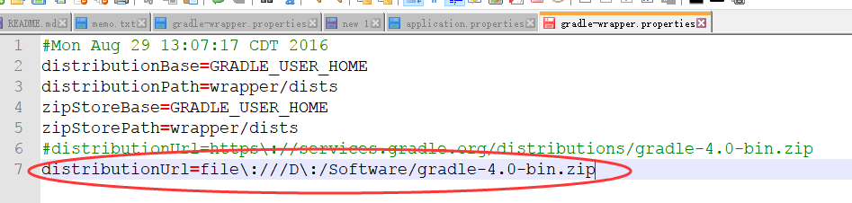

 日志管理
==


日志管理用于记录日志, 并提供全文检索. 本方案采用Elasticsearch全文搜索引擎.

本服务提供两个接口, 一个是追加记录, 一个是搜索.


基本信息:
--

* Version 1.0 
* [REST API docs] 待定
* APP Entrance:  

### 开发环境搭建 ###

- 准备工作 [Elasticsearch镜像使用说明](Elastic.md)


- 下载代码 : http://mdm.sunwayworld.com/svn/iframework/iframework/trunk/lims-cloud/logger


- 执行命令
到logger项目所在的目录执行. 

```
eclipse.bat
```

- 解决速度奇慢的问题

在执行的过程中, 系统要下载gradle-4.0-bin.zip. 你用自己喜欢的下载工具,快速把gradle-4.0-bin.zip下载好, 放在D:\Software 下面.  然后修改下面这个文件.

....\workspace\limscloud\logger\logger\gradle\wrapper

把里面的互联网路径注掉, 换成本地路径.

```
#distributionUrl=https\://services.gradle.org/distributions/gradle-4.0-bin.zip
distributionUrl=file\:///D\:/Software/gradle-4.0-bin.zip
```




- 导入到Eclipse里面

- 修改邮箱账户
把下面文件中的邮箱账号密码改成你自己的.
...\limscloud\logger\logger\src\main\resources\application.properties

```
smtp.senderEmail=qijb@sunwayworld.com
smtp.senderPassword=xxxx
 
```

-  配置

找到项目的application.properties文件, 把下面的URL换成你在第一步搭建环境 Elasticsearch 的服务url

```
elastic.contextPath=http://192.168.1.30:9200
 
```


###  快速测试 ###

-  编译jar包

```
build.bat
```

-  执行 jar 包

在 ...\limscloud\logger\logger\build\libs 下面找到 logger-1.0.jar 

打开命令行环境, 切换到上面这个目录下面. ```  cd  xxxxxx ``` , 然后执行下面的命令.

```
 java -jar  logger-1.0.jar
```
-  浏览器里面验证
   * [REST API docs](http://localhost/swagger-ui.html) 
   * APP Entrance: http://localhost/swagger-ui.html 

   

### 部署生产环境 ###

 
- 编译jar包

```
build.bat
```

- 部署

上传到 /home/docker/logger, 然后执行 :

```
./jardeployment.sh

```
  
### 参考文献 ###

Docker 官方镜像

https://docs.docker.com/samples/library/elasticsearch/

https://github.com/docker-library/elasticsearch

https://www.elastic.co/guide/en/elasticsearch/reference/current/getting-started.html


中文指南 

http://www.ruanyifeng.com/blog/2017/08/elasticsearch.html

http://www.cnblogs.com/guochunguang/articles/3641008.html
  