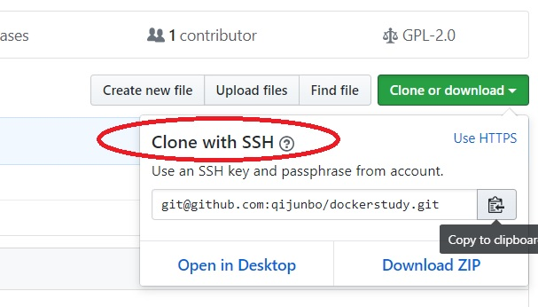

# dockerstudy
all kinds of docker  images design

# Index of Content

- [Start a mysql db](mysql/README.md)
- [Start a webapp use the db](java8/README.md)
- [multi-service](multi-service/README.md)


# Question 1

Why some exit while others keep running when you run containers using follwing command.

```
docker run -d  container_name 
```
那是因为

```
CMD ["commands", "parm"]
```

有的执行完了就推出了, 有的长期运行,永不停歇.


# How to add github ssh key
- Create RSA key pare on you own pc
		
```
ssh-keygen

root@ubuntu:~/webapp# ssh-keygen
Generating public/private rsa key pair.
Enter file in which to save the key (/root/.ssh/id_rsa):
Enter passphrase (empty for no passphrase):
Enter same passphrase again:
Your identification has been saved in /root/.ssh/id_rsa.
Your public key has been saved in /root/.ssh/id_rsa.pub.
The key fingerprint is:
SHA256:C3Q8gArwTTbq61hi8d8JGuhMYpSHg598UH5CTUN0XCs root@ubuntu
The key's randomart image is:
+---[RSA 2048]----+
|o   ++*....      |
|.. =.+ =.  .     |
| .o.+ o E .      |
|..++ . . o       |
|.*o.o o S        |
|.o*+ o . .       |
|o=*o..  .        |
|B= .+ o .        |
|.o.. . o         |
+----[SHA256]-----+

cd ~/.ssh

root@ubuntu:~/.ssh# cat id_rsa.pub
```

- Copy the content of id_rsa.pub to [https://github.com/settings/keys](https://github.com/settings/keys)
1. Click the "New ssh key" button on the top-right corner.



2. Paste what you copy from 'cat id_rsa.put' command, and save.

# How to get and push code from and to github.
- Get 

```
git clone git@github.com:qijunbo/dockerstudy.git
```

- Put

```
## add the file you want.
git add README.md
## add every thing 
git add ./
git commit -m "Initial commit"
git push -u origin master
```
when you do this for the first time , you encounter this problem.

```
root@ubuntu:~/dockerstudy# git commit -m "add readme"

*** Please tell me who you are.

Run

  git config --global user.email "you@example.com"
  git config --global user.name "Your Name"

to set your account's default identity.
Omit --global to set the identity only in this repository.

fatal: unable to auto-detect email address (got 'root@ubuntu.(none)')
```
try this, and then you did it. 
```
root@ubuntu:~/dockerstudy# git config --global user.email "junboqi@foxmail.com"

root@ubuntu:~/dockerstudy# git commit -m "add readme"
[master f819abb] add readme
 1 file changed, 82 insertions(+)
root@ubuntu:~/dockerstudy# git push -u origin master
Counting objects: 3, done.
Compressing objects: 100% (3/3), done.
Writing objects: 100% (3/3), 1.17 KiB | 0 bytes/s, done.
Total 3 (delta 0), reused 0 (delta 0)
To git@github.com:qijunbo/dockerstudy.git
   06532b0..f819abb  master -> master
Branch master set up to track remote branch master from origin.

```
- Update

You may want to get the latest code somehow.

```
git pull

root@ubuntu:~/dockerstudy# git pull
remote: Counting objects: 5, done.
remote: Compressing objects: 100% (3/3), done.
remote: Total 5 (delta 1), reused 5 (delta 1), pack-reused 0
Unpacking objects: 100% (5/5), done.
From github.com:qijunbo/dockerstudy
   529dbfc..089d33e  master     -> origin/master
Updating 529dbfc..089d33e
Fast-forward
 README.md           |  11 ++++++++++-
 pictures/sshurl.jpg | Bin 0 -> 54698 bytes
 2 files changed, 10 insertions(+), 1 deletion(-)
 create mode 100644 pictures/sshurl.jpg

```


