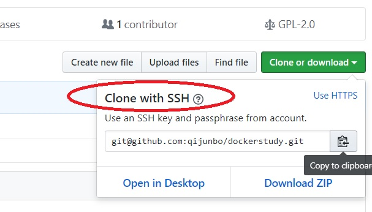

代码提交一般有五个步骤：
==

### 查看目前代码的修改状态

```
git status
```

### 查看代码修改内容

```
git diff  <file>   
注意：如果该文件已暂存，那么应该使用git diff –-cached  <file>

git diff <hashcode> <hashcode>  <file>

比较某文件在提交节点a，节点b的差异。

技巧：如果省略后面一个hashcode，则默认表示与上一提交节点比较。（也可以利用^运算符）

```

### 暂存需要提交的文件

```
欲提交单个文件
git add  file

欲提交所有文件
git add  .

欲提交指定目录下的文件
git add  folder/*

欲提交所有变动, 包含删除的文件
git add . --all

取消欲提交的文件, 但是不清除修改, 还留着那些变动.
git reset HEAD <file>...  撤出暂存区

使用 "git checkout -- <file>..." 丢弃工作区的改动
 

```

### 提交已暂存的文件

```
git commit -m "comment messages"
```
 

### 同步到服务器

```
查看本地分支
git branch

如果本地有多个分支, 则当前分支前面有个 * 符号.


提交前先拉取代码
git pull


如果执行失败，就按照提示还原有冲突的文件，然后再次尝试同步。

命令：git checkout  --  <有冲突的文件路径>

同步到服务器

命令： git push origin  <本地分支名>

 
```

其它
==

### 在多个分支上来回切换

```
脱离当前分支, 切到 stack 分支上去
git branch  stack
git checkout stack
git checkout .
git pull 
 
保存修改, 提交到 stack分支上去

git add . -all
git commit -m "some message"
git push -u origin stack
```

# How to add github ssh key
- Create RSA key pare on you own pc
		
```
ssh-keygen

root@ubuntu:~/webapp# ssh-keygen
Generating public/private rsa key pair.
Enter file in which to save the key (/root/.ssh/id_rsa):
Enter passphrase (empty for no passphrase):
Enter same passphrase again:
Your identification has been saved in /root/.ssh/id_rsa.
Your public key has been saved in /root/.ssh/id_rsa.pub.
The key fingerprint is:
SHA256:C3Q8gArwTTbq61hi8d8JGuhMYpSHg598UH5CTUN0XCs root@ubuntu
The key's randomart image is:
+---[RSA 2048]----+
|o   ++*....      |
|.. =.+ =.  .     |
| .o.+ o E .      |
|..++ . . o       |
|.*o.o o S        |
|.o*+ o . .       |
|o=*o..  .        |
|B= .+ o .        |
|.o.. . o         |
+----[SHA256]-----+

cd ~/.ssh

root@ubuntu:~/.ssh# cat id_rsa.pub
```

- Copy the content of id_rsa.pub to [https://github.com/settings/keys](https://github.com/settings/keys)
1. Click the "New ssh key" button on the top-right corner.



2. Paste what you copy from 'cat id_rsa.put' command, and save.

# How to get and push code from and to github.
- Get 

```
git clone git@github.com:qijunbo/dockerstudy.git
```

获取指定的分支

```
git clone  git@github.com:qijunbo/dockerstudy.git -b 分支名
```

获取指定历史版本

```
git checkout b0362a895d39061c0bc6f05c575af47de1b3f702

```


- Put

```
## add the file you want.
git add README.md
## add every thing 
git add ./
git commit -m "Initial commit"
git push -u origin master
```
when you do this for the first time , you encounter this problem.

```
root@ubuntu:~/dockerstudy# git commit -m "add readme"

*** Please tell me who you are.

Run

  git config --global user.email "you@example.com"
  git config --global user.name "Your Name"

to set your account's default identity.
Omit --global to set the identity only in this repository.

fatal: unable to auto-detect email address (got 'root@ubuntu.(none)')
```
try this, and then you did it. 
```
root@ubuntu:~/dockerstudy# git config --global user.email "junboqi@foxmail.com"

root@ubuntu:~/dockerstudy# git commit -m "add readme"
[master f819abb] add readme
 1 file changed, 82 insertions(+)
root@ubuntu:~/dockerstudy# git push -u origin master
Counting objects: 3, done.
Compressing objects: 100% (3/3), done.
Writing objects: 100% (3/3), 1.17 KiB | 0 bytes/s, done.
Total 3 (delta 0), reused 0 (delta 0)
To git@github.com:qijunbo/dockerstudy.git
   06532b0..f819abb  master -> master
Branch master set up to track remote branch master from origin.

```
- Update

You may want to get the latest code somehow.

```
git pull

root@ubuntu:~/dockerstudy# git pull
remote: Counting objects: 5, done.
remote: Compressing objects: 100% (3/3), done.
remote: Total 5 (delta 1), reused 5 (delta 1), pack-reused 0
Unpacking objects: 100% (5/5), done.
From github.com:qijunbo/dockerstudy
   529dbfc..089d33e  master     -> origin/master
Updating 529dbfc..089d33e
Fast-forward
 README.md           |  11 ++++++++++-
 pictures/sshurl.jpg | Bin 0 -> 54698 bytes
 2 files changed, 10 insertions(+), 1 deletion(-)
 create mode 100644 pictures/sshurl.jpg

```
- drop what have changed

```
git checkout . #本地所有修改的。没有的提交的，都返回到原来的状态
git stash #把所有没有提交的修改暂存到stash里面。可用git stash pop回复。
git reset --hard HEAD #返回到某个节点，不保留修改。
git reset --soft HEAD #返回到某个节点。保留修改

git clean -df #返回到某个节点
git clean 参数
    -n 显示 将要 删除的 文件 和  目录
    -f 删除 文件
    -df 删除 文件 和 目录

git checkout . && git clean -xdf
```


- Submodules

```
mkdir Dashboard
cd Dashboard
git init
touch README.md
git add README.md
git commit -m "first commit"
git remote add origin https://gitee.com/qijunbo/Dashboard.git
git push -u origin master


git submodule add ./limscloud.git Dashboard
git add ./
git commit -m "Dashboard"
git remote add origin https://gitee.com/qijunbo/SIAS.git
git push -u origin master
```

or create a new repository on the command line
--

```
echo "# cos" >> README.md
git init
git add README.md
git commit -m "first commit"
git remote add origin git@github.com:qijunbo/cos.git
git push -u origin master
```

or push an existing repository from the command line

--
```
git remote add origin git@github.com:qijunbo/cos.git
git push -u origin master
```


回滚单个文件

```
步骤一：

查看要回退文件的历史记录

 git log --oneline --  a.txt


比方说，这是我们需要回退到merge trunk的状态

其版本sha1为 120a893


使用reset命令，默认是 --soft

git reset 120a893  --   a.txt

```


1. 查看远程分支
```
$ git branch -r 
```
2. 查看本地分支
```
$ git branch

```
3. 拉取远程分支并创建本地分支

使用该方式会在本地新建分支x，并自动切换到该本地分支x。
```
$ git checkout -b 本地分支名x origin/远程分支名x 
```
4. 切换到 another 分支(前提是已经使用上面一步， 创建了本地分支 another)
```
$ git checkout another 
```

5. 创建/删除本地分支
```
git branch test

git branch -d  test
```