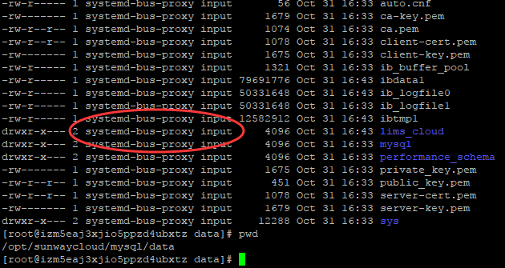

How to Use Mysql Docker Image.
==

Reference
--
http://www.runoob.com/mysql/mysql-create-database.html

**Note:** 本文以MySql 8.0 做实验 

https://github.com/docker-library/mysql/tree/master/8.0

https://github.com/mysql/mysql-docker


Script List
--

<table>
<tr><th>Name</th><th>Description</th></tr>
<tr><td>startmysql.sh</td><td>&nbsp;启动一个官方的mysql容器, 并且初始化脚本.</td></tr>
<tr><td>start@currentdir.sh</td><td>以当前文件夹为工作目录运行容器(方便用完后删除干净)</td></tr>
<tr><td>startwithconf.sh</td><td>&nbsp;启动一个官方的mysql容器, 初始化脚本, 并且使用自定义配置文件.</td></tr>
<tr><td>startwithout-P.sh</td><td>&nbsp;启动一个官方的mysql容器, 初始化脚本, 不使用端口映射, 无法从外部分访问.</td></tr>
<tr><td>verify.sh</td><td>&nbsp;验证创建的容器是否执行了初始脚本, 用户my.cnf文件是否生效, 是否可以从外部联网.<br/> ** 唉, 尼玛, 我是不是太有才了  :-D **</td></tr>

<tr><td>README.md</td><td>这个文档.</td></tr>
<tr><td>start@currentdir.sh</td><td>直接把数据放在当前目录下面, 清理时删除当前目录就可以了.</td></tr>
<tr><td>autorestart.sh</td><td>遇到意外关机是,开机容器随着docker自动启动</td></tr>
<tr><td>docker.cnf</td><td>mysql 自定义配置文件 </td></tr>
<tr><td>init.sql</td><td>数据库初始化脚本</td></tr>
<tr><td>startcreateDB.sh</td><td>不要数据初始化脚本, 容器启动时创建指定名称的数据库</td></tr>
<tr><td>startwordpress.sh</td><td>启动一个wordpress应用,使用该数据库.</td></tr>
</table>

 
Directly Use
----

MySql 容器预置了参数, 允许你在启动容器的时候传入数据库root用户的初始密码. 如下: 

```
mkdir -p  /root/data/mysql

docker run --name mysql -e MYSQL_ROOT_PASSWORD=sunway123# -d -p 3306:3306 -v /root/data/mysql:/var/lib/mysql mysql
 
docker container exec -it mysql bash

mysql -u root -p 
密码： sunway123#

```
局限性:  容器重启,数据就丢失了.  所以你需要吧数据外部化.

 
Container customization
--
MySql容器还允许你在启动容器的时候指定一个sql脚本, 它会自动执行.

-  create folders tobe binded with container

```
mkdir -p  /root/mysql/user1/data
mkdir -p  /root/mysql/user1/initsql
mkdir -p  /root/mysql/user1/conf
```	
- Running custom init scripts at database creation
 
copy your  **create_db.sql** into folder  **/docker-entrypoint-initdb.d**,  the sql script will be executed on container start.

```
docker run --name mysql -e MYSQL_ROOT_PASSWORD=sunway123# -d -p 3306:3306 \
	-v /root/mysql/user1/data:/var/lib/mysql  \
	-v /root/mysql/user1/initsql:/docker-entrypoint-initdb.d \
	-v /root/mysql/user1/conf:/etc/mysql/conf.d    mysql
 
docker container exec -it mysql bash

mysql -u root -p 
密码： sunway123#

```

然后你会发现mysql容器写文件的权限是这样的, 不要随意改.



- chek environment variables

```
mysqladmin -u root -p variables  | grep  "case"
```

- 查看版本号 (version)

```
$>  mysql -V

or

$> mysql --help | grep "Distrib"

or

mysql> select version();

or

mysql> \s

```	

	
Create DB
--
	mysqladmin -u root -p create dbs_dev DEFAULT CHARSET utf8 COLLATE utf8_general_ci
	
	//or
	mysql -u root -p
	
    CREATE DATABASE IF NOT EXISTS dbs_dev DEFAULT CHARSET utf8 COLLATE utf8_general_ci;
Initialize the DB
--
There are three ways here, you can choose any of them.

```
mysql -u [username] -h [hostname] -P [port] -p db < tables.sql
mysql -u root -p -D dbs_dev </var/lib/mysql/dbs_dev.sql
```
注意：
A、如果在sql脚本文件中使用了use DBNAME ，则-D数据库选项可以忽略
   
```
cd  /root/data/mysql
mysql -u root -p
use dbs_dev
source dbs_dev.sql
```


```
mysql -u root -p
use dbs_dev
\. /var/lib/mysql/dbs_dev.sql
```

Two ways of starting mysqld with your own conf file.
--

### Way 1 mount file ###

 from [https://github.com/mysql/mysql-docker](https://github.com/mysql/mysql-docker#using-a-custom-mysql-config-file)

- Using a Custom MySQL Config File

First, create your own configure file, saying -- docker.cnf -- , copy this content, to make mysql table names case insensitive.(the third line)

```
[mysqld]
skip-host-cache
skip-name-resolve
lower_case_table_names = 1

```
The mount the **file name** to  ** my.cnf** within the container, ** It'seems crazy, but it really work ** with [mysql-docker](https://github.com/qijunbo/mysql-docker) [mysql  Ver 14.14 Distrib 5.7.19] 

```
docker run --name goodname -v /my/custom/docker.cnf:/etc/my.cnf -e MYSQL_ROOT_PASSWORD=my-secret-pw -d mysql/mysql-server:tag
```
### Way 2 mout directory ###

From [https://github.com/docker-library/docs/tree/master/mysql](https://github.com/docker-library/docs/tree/master/mysql#using-a-custom-mysql-configuration-file)

You config file must end with ** .cnf ** 

If /my/custom/config-file.cnf is the path and name of your custom configuration file, you can start your mysql container like this ** note that only the directory path of the custom config file is used in this command ** :

```
docker run --name goodname -v /my/custom:/etc/mysql/conf.d -e MYSQL_ROOT_PASSWORD=my-secret-pw -d mysql:tag
```

# How to use offical MYSQL  docker image

### How to run tests

* Get in the Container
```
docker exec -it qijunbo mysql -uroot -psunway123#
or
docker exec -it qijunbo bash
```

* Check if the init.sql is executed to create the DB.

```
mysql -uroot -psunway123#
show databases;
```

* Check if you can connect from outside

```
SELECT host FROM mysql.user WHERE User = 'root';

```

If you only see results with localhost and 127.0.0.1, you cannot connect from an external source. If you see other IP addresses, but not the one you're connecting from - that's also an indication.

You will need to add the IP address of each system that you want to grant access to, and then grant privileges:

```
CREATE USER 'root'@'ip_address' IDENTIFIED BY 'some_pass';
GRANT ALL PRIVILEGES ON *.* TO 'root'@'ip_address';
```

If you see %, well then, there's another problem altogether as that is "any remote source". 


```
+-----------+
| host      |
+-----------+
| %         |
| localhost |
+-----------+

```

If however you do want any/all systems to connect via root, use the % wildcard to grant access:

```
CREATE USER 'root'@'%' IDENTIFIED BY 'some_pass';
GRANT ALL PRIVILEGES ON *.* TO 'root'@'%';  
```

Finally, reload the permissions, and you should be able to have remote access:
```
FLUSH PRIVILEGES;
```
if you want to lean more, refer this link [host-is-not-allowed-to-connect-to-this-mysql-server](https://stackoverflow.com/questions/19101243/error-1130-hy000-host-is-not-allowed-to-connect-to-this-mysql-server) for more information.


* Check table name insensitive

```
mysqladmin -u root -psunway123# variables  | grep  "case"
```

and you must get this .

```
| lower_case_file_system                                   | OFF                                                                                                                                                                                                                                                                                                                                                                                                                                        |
| lower_case_table_names                                   | 1     
```

* Network tools

you need to try ** ip **,  ** ping ** , or else,  it would be tough to debug.
```
docker exec -it qijunbo ping 172.17.0.1 
```


	