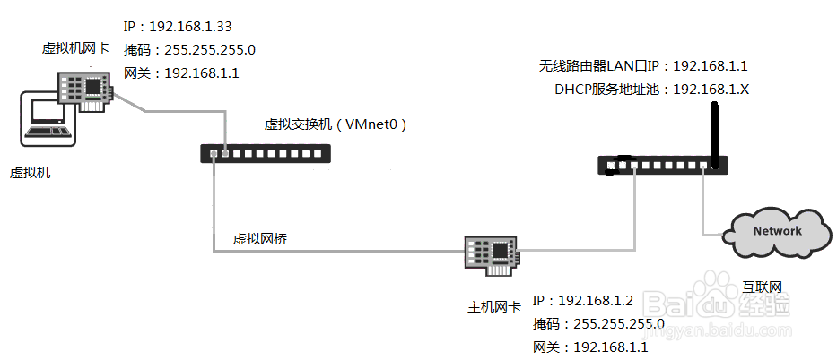
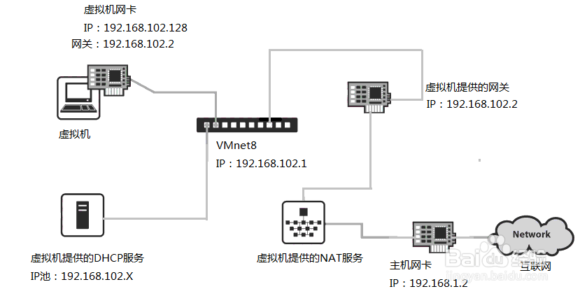
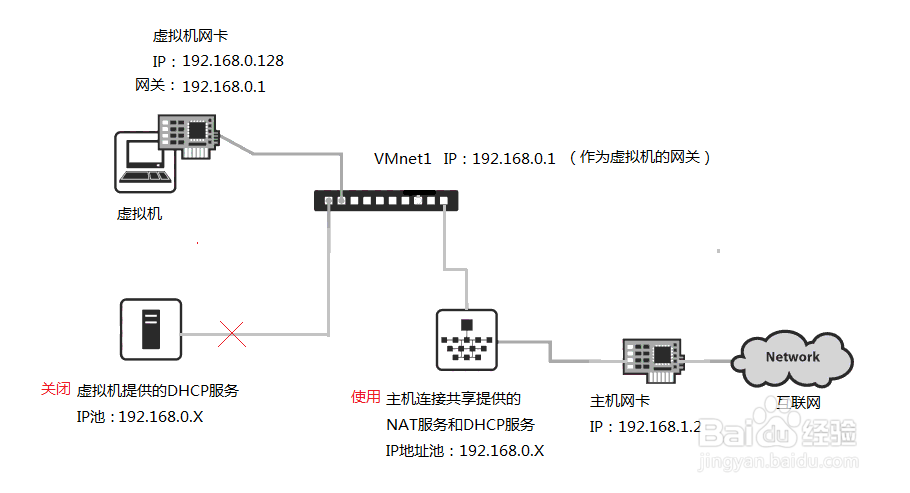

Reference
==

https://docs.docker.com/compose/networking/#use-a-pre-existing-network

[example](https://github.com/docker/labs/blob/master/beginner/chapters/votingapp.md)

About drivers
==

选择桥接模式（Bridged）
--
使用VMnet0。在此模式下，虚拟机和主机就好比插在同一台交换机上的两台电脑。如果主机连接在开启了DHCP服务的（无线）路由器上，这时虚拟机能够自动获得IP地址。如果局域网内没有提供DHCP服务的设备，那就需要手动配置  IP地址，只需仿照主机网卡的IP地址，设置一个同网段的不同的IP地址即可，一般只需修改IP地址的最后第四位数字不同就行了，其它的照搬。只要IP地址在同一网段内，那么局域网内的所有同网段的电脑都能互访。这样虚拟机和主机一样能够上网了。

在桥接模式下，如果电脑主机安装有多块网卡的话，应该手动指定要桥接的那块网卡。点击VMware软件的“编辑”，选“编辑虚拟网路”，点击VMnet0，在“ 已桥接到” 的地方指定那块用来上网的网卡。如果只有一块上网的网卡，可以不用修改，默认自动连接这块网卡。

选择网络地址转换模式（NAT）
--
使用VMnet8。采用这种模式，如果主机能够正常上网，那么虚拟机也能够直接上网。此时虚拟机处于一个新的网段内，由VMware提供的DHCP服务自动分配IP地址，然后通过VMware提供的NAT服务，共享主机实现上网。从上图可以看到VMnet8处于192.168.102.0这个网段上。
在NAT模式下，虚拟机可以访问主机所在局域网内所有同网段的电脑，但除了主机外，局域网内的其它电脑都无法访问虚拟机。要查看虚拟机在NAT模式下DHCP服务和网关地址设置，可以按照上面第3步骤，打开“编辑虚拟网络”，点击VMnet8，然后点击DHCP设置，可以看到网段地址池范围，点击NAT设置，可以看到网关设置。

选择主机模式（Host-Only）
--
使用VMnet1。在此模式下，虚拟机处于一个独立的网段中。与NAT模式比较可以发现，此模式下虚拟机没有提供NAT服务，所以此时虚拟机无法上网，但可使用Windows系统提供的连接共享功能实现共享上网。虚拟机在此模式下，所谓“与主机共享一个私有网络”，是指主机能与此模式下的所有虚拟机互访，就像在一个私有的局域网内一样可以实现文件共享等功能。如果没有开启Windows的连接共享功能的话，除了主机外，虚拟机与主机所在的局域网内的所有其它电脑之间无法互访。下面是开启Windows连接共享示意图。

来源； https://jingyan.baidu.com/album/414eccf65341826b431f0a36.html?picindex=2

