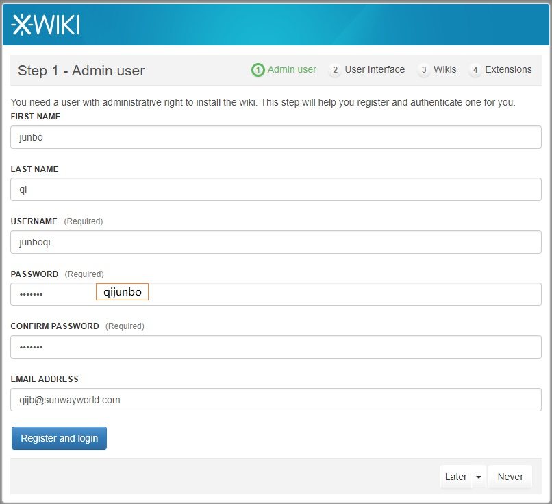

Xwiki
==

#### 启动容器
```
docker-compose up -d
```


#### 访问主页
http://localhost:8101





Reference:
==
https://docs.docker.com/samples/library/xwiki/#using-docker-run

Other wikis

https://hub.docker.com/r/leanote/leanote/

https://hub.docker.com/r/synctree/mediawiki/

https://hub.docker.com/r/dockerxman/docker-gitblog/

https://www.zhihu.com/question/21172379